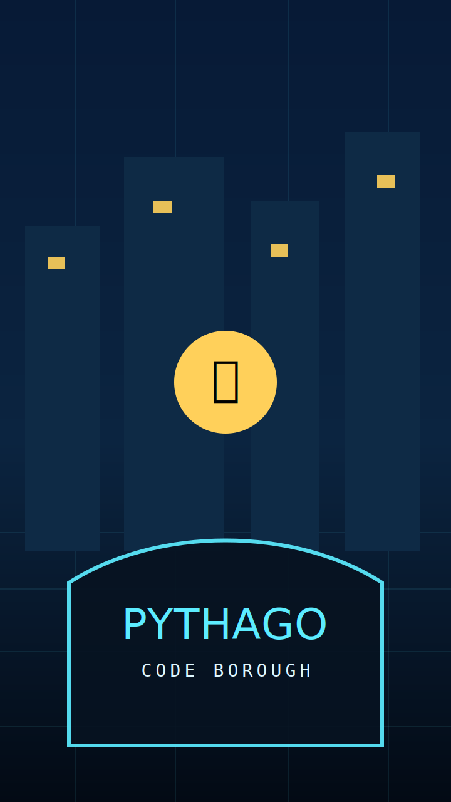

# PythaGo: Code Borough

PythaGo is a story-driven mobile game where players learn real Python by restoring a futuristic city. It runs in **Expo Go**, renders the world with **Phaser**, and executes Python locally through **Pyodide/CPython WebAssembly**.



## Playable vertical slice

The first district includes:

- High-resolution vector player and Byte robot sprites with Phaser animation
- A Phaser city scene with touch movement controls
- Five missions: `print`, variables, `if/else`, loops, and functions
- Real local Python compilation and execution in a resettable Web Worker
- Output capture, syntax/runtime errors, line feedback, test assertions, and a time limit
- Python-to-game actions: `activate()`, `recharge()`, `say()`, and `unlock()`
- XP, mission unlocks, and persistent progress with AsyncStorage
- Pyodide/CPython WebAssembly loaded from the official jsDelivr distribution

## Run with Expo Go

```bash
npm install
npx expo start --clear
```

Scan the QR code with Expo Go.


## EAS / GitHub builds

Use these values on the Expo “Start a build from GitHub” screen:

- **GitHub repository:** `LMMinier/PythaGo`
- **Base directory:** leave this field completely blank. Do **not** enter `/main`; this app is at the repository root, and `/main` makes EAS look for `/main/package.json`, which does not exist.
- **Git ref:** `main` or a specific commit SHA from `main`
- **Build profile:** `Pyright` if you select that Expo profile, `production` for store builds, `preview` for an internal Android APK, or `development` for a development-client build
- **Environment:** `Production` for release builds; `Default` is fine while testing

Before a production EAS build can succeed, configure credentials in Expo/EAS. Credentials are intentionally not stored in this repository. Android can use an EAS-managed keystore; iOS requires access to the Apple Developer Program so EAS can create or import the distribution certificate and provisioning profile.

Local setup commands:

```bash
npm install
npx eas-cli@latest login
npx eas-cli@latest build:configure
npx eas-cli@latest credentials
npx eas-cli@latest build --platform android --profile preview
npx eas-cli@latest build --platform all --profile production
```

If you only want to test in Expo Go or Snack, you do not need EAS credentials. Run `npx expo start --clear` and scan the QR code instead.


### EAS troubleshooting

If EAS shows `Failed to read "/main/package.json"`, the build form is pointing at a nonexistent subdirectory. Edit the GitHub build settings and clear **Base directory** so it is empty, then rerun the build from Git ref `main`. This cannot be fixed by `eas.json`; Expo must be told not to look in `/main`.

The credentials warning is separate from the `/main/package.json` error. After the base directory is blank, configure build credentials in EAS: choose an EAS-managed Android keystore for Android, and use an Apple Developer account or imported distribution certificate/provisioning profile for iOS. If you select the `Pyright` build or submit profile in Expo, keep the `Pyright` entries in `eas.json` so EAS can find that profile after it reads the root `package.json`.


### GitHub PR conflict troubleshooting

If GitHub shows “Resolving conflicts between `main` and `codex/complete-github-repository-upload`”, resolve that before starting another EAS build. The build should run from a clean `main` commit, not from a PR that still has conflict markers or unresolved add/add conflicts.

Recommended local fix:

```bash
git checkout codex/complete-github-repository-upload
git fetch origin main
git merge origin/main
# Choose the intended versions of the conflicted files, then:
git add README.md eas.json public/game/*.svg src/gameScene.ts src/lessons.ts src/pythonRunner.ts
npm run typecheck
npm run export:web
git commit
git push
```

Do not paste conflict-marker blocks (`<<<<<<<`, `=======`, `>>>>>>>`) into SVG or TypeScript files. After the conflict-resolution commit is pushed, GitHub should stop listing the files as conflicting and the PR can be merged into `main`.

## Validate

```bash
npm run typecheck
npm run export:web
```

## Architecture

```text
App.tsx                 Native Expo shell and persistence
src/GameDom.tsx         DOM UI, progression, and game loop
src/gameScene.ts        Phaser scene and game reactions
src/pythonRunner.ts     Pyodide worker sandbox
src/lessons.ts          Workshop curriculum and tests
public/game             Generated art and sprites
```

The client sandbox is appropriate for normal educational missions, not adversarial public code execution. Competitive submissions should eventually run inside server-side containers as a second boundary.

## License

MIT for code. Generated artwork is included for use with this project and is not a standalone asset pack.
